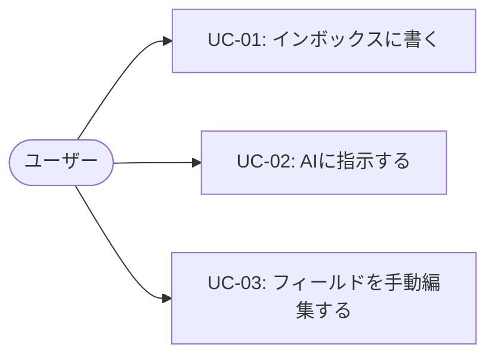
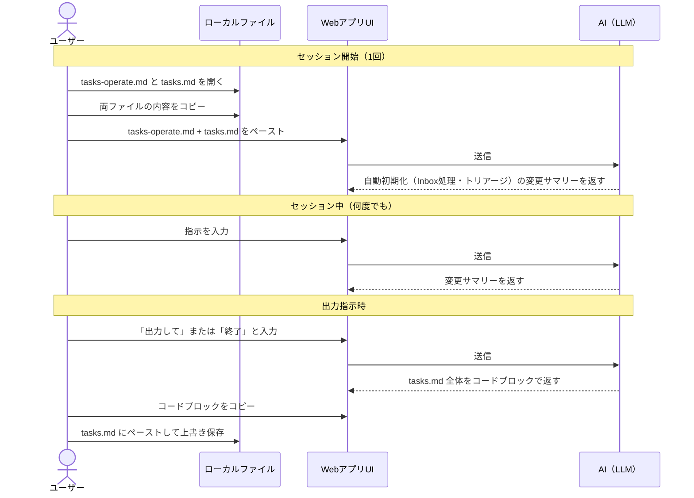
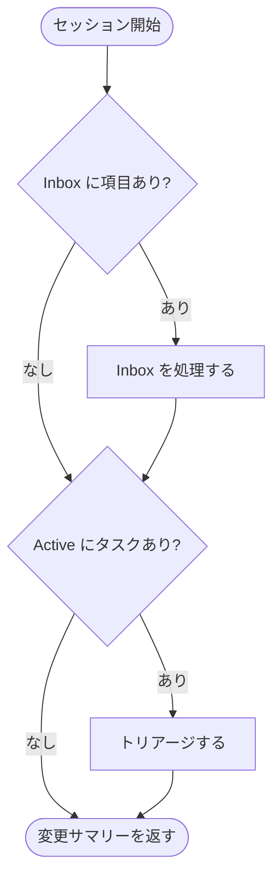
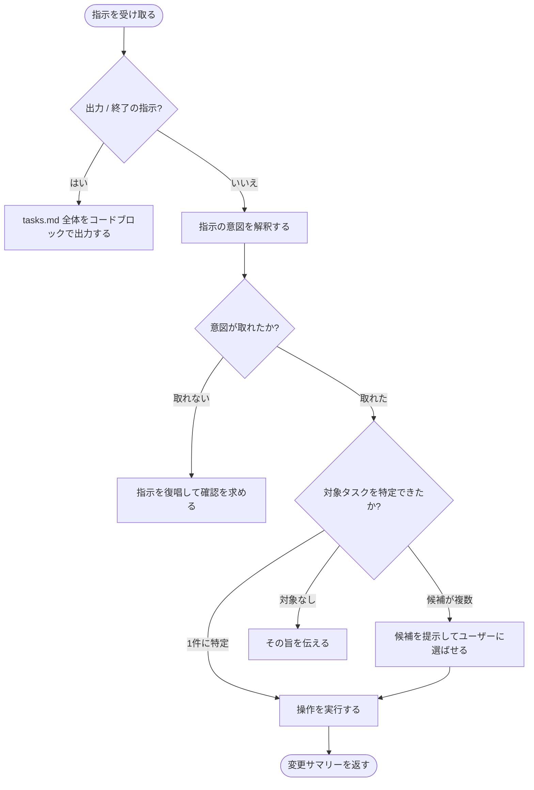

# AIタスクマネジメント・プロンプトシステム 要件定義

## ゴール

Webアプリ上でAIと対話するインターフェースを通じて、ユーザーが自然言語でタスクを管理できるシステムを実現する。タスクの登録・確認・更新・完了報告を会話形式で行い、直感的なタスク管理体験を提供する。

## 設計原則

- **REQUIREMENTS.md 駆動**: システムのコード・設定・ドキュメントは本ファイルを単一情報源として生成・再生成する
- **CLI AI 非依存の自己改良**: Claude Code 等の CLI AI ツールが使えない環境（Webアプリ上のAIのみ利用可能な状況）でも、本ファイルを更新してAIに渡すだけでシステムの改良・開発が継続できること。AIへの指示はすべて本ファイルを渡すだけで完結できる粒度で記述する

## スコープ

**対象**:
- Claude.ai / ChatGPT 等の既存チャットUI（Webアプリ）を使用する
- プロンプト設計（タスク操作の意図解析・応答生成）
- タスクの登録・一覧表示・更新・完了報告機能
- タスクデータの永続化

**対象外**:
- チーム共有・複数ユーザー対応
- カレンダー連携・通知機能
- モバイルアプリ（iOS / Android ネイティブ）
- 外部タスク管理ツール（Notion・Jira等）との連携

## ユースケース



### UC-01: インボックスに書く（キャプチャ）

- **アクター**: ユーザー
- **事前条件**: （なし）
- **メインフロー**:
  1. 思いついたことを `tasks.md` のインボックスセクションに自由に書く
  2. それだけ。処理はAIに任せる（UC-02）
- **備考**:
  - 形式は問わない。箇条書き・一行メモ・走り書きすべて可
  - インボックスは「考えずに書ける場所」として機能する

### UC-02: AIに指示する（メインフロー）

- **アクター**: ユーザー
- **事前条件**: （なし）
- **メインフロー**:
  1. ユーザーが `tasks-operate.md` と `tasks.md` をコピーしてWebアプリUIにペーストする
  2. 自然言語で指示を入力する
  3. AIが更新済み `tasks.md` を返す
  4. ユーザーが内容を確認し、`tasks.md` にペーストして上書き保存する
- **代替フロー**:
  - AIが判断できない場合（期日・優先度が不明など）、ユーザーに確認を求める
- **指示の例**:

| 指示例 | AIの動作 |
|--------|---------|
| 「資料作成が終わった」 | 該当タスクを `done` に更新 |
| 「週次レビューをして」 | 完了集計・保留見直し・翌週MIT候補を提示 |
| 「アーカイブして」 | `done` タスクを抽出しアーカイブ用内容を生成 |
| 「資料作成の締め切りを来週月曜に変えて」 | 該当タスクの `due` を更新 |

### UC-03: フィールドを手動編集する（例外）

- **アクター**: ユーザー
- **事前条件**: （なし）
- **メインフロー**:
  1. ユーザーが `tasks.md` を直接テキストエディタで開いて編集する
  2. 上書き保存する
- **備考**:
  - 基本はAIへの指示（UC-02）で完結させる
  - 手動編集はAIに任せると整合性が崩れそうな微修正に限定することが望ましい
  - 例：締め切りを1日ずらす、タグを追加するなど

## システム概要

### ファイル構成

| ファイル | 役割 | 変更頻度 |
|---------|------|---------|
| `tasks-operate.md` | AIへの振る舞い定義（システムプロンプト） | 低（機能追加・改善時のみ） |
| `tasks.md` | タスクデータ（単一情報源） | 高（毎セッション） |
| `tasks-archive-YYYY-MM.md` | 月次アーカイブ | 月1回 |

### 操作フロー

セッションの開始・中・終了の3フェーズに分かれる。コピペ操作はセッションの最初と最後に1回ずつ行うだけでよい。



**補足**:
- `tasks-operate.md` はほぼ変更しないため、毎回コピペしても負担は小さい
- セッション中はAIがコンテキストを保持するため tasks.md の貼り直しは不要
- 通常の指示への応答は変更サマリーのみ。全文出力は明示指示時のみ
- サーバーへの保存は行わない。状態は常にローカルの tasks.md が保持する

## 仕様

### tasks.md 仕様

タスクの保存・入出力は `tasks.md` 単一ファイルで行う。AIとのやり取りはこのファイルをコピペして渡す／受け取る形式とする。ファイルは200行以内を目安に管理し、超過時はアーカイブする（「アーカイブして」と指示）。

#### セクション構造

GTDの収集→整理→実行→レビューを単一ファイル内のセクションで実現する。

```markdown
---
updated: YYYY-MM-DD
---

## Inbox
<!-- Capture anything here without thinking. Process later with AI. -->
- 来週の発表の準備
- 本棚を整理する

## MIT (Most Important Tasks, max 3)
- [ ] 資料作成

## Active
| id | title | status | priority | due | depends_on | tags | estimate |
|----|-------|--------|----------|-----|------------|------|----------|
| 1  | 資料作成 | in-progress | high | 2026-04-30 | — | work, report | 3h |
| 2  | レビュー依頼 | todo | high | 2026-05-02 | 1 | work | 1h |
| 3  | 会議準備 | todo | medium | 2026-05-01 | — | work | 2h |

## Someday / Maybe
- 本棚を整理する

## Gantt Chart
​```mermaid
gantt
    dateFormat  YYYY-MM-DD
    section Tasks
    資料作成      :active, t1, 2026-04-27, 2026-04-30
    レビュー依頼  :t2, after t1, 2026-05-02
    会議準備      :t3, 2026-04-29, 2026-05-01
​```

## Dependency Graph
​```mermaid
graph LR
    t1[資料作成] --> t2[レビュー依頼]
    t3[会議準備]
​```

## Priority Matrix
​```mermaid
quadrantChart
    x-axis Low Urgency --> High Urgency
    y-axis Low Importance --> High Importance
    quadrant-1 Do First
    quadrant-2 Schedule
    quadrant-3 Delegate / Defer
    quadrant-4 Drop
    資料作成: [0.8, 0.9]
    レビュー依頼: [0.6, 0.8]
    会議準備: [0.5, 0.4]
​```
```

#### フィールド定義

| フィールド | 型 | 値 | 備考 |
|-----------|----|----|------|
| `id` | number | 連番 | 削除後も再利用しない |
| `title` | string | 自由記述 | タスク名 |
| `status` | enum | `todo` / `in-progress` / `done` / `cancelled` / `blocked` | |
| `priority` | enum | `critical` / `high` / `medium` / `low` | |
| `due` | date | `YYYY-MM-DD` | ISO 8601。期日なしは `—` |
| `depends_on` | list | `1, 2` | 先行タスクのidをカンマ区切り。なければ `—` |
| `tags` | list | `work, report` | カンマ区切り。なければ `—` |
| `estimate` | string | `2h` / `1d` | 作業見積もり。なければ `—` |

#### AIとの役割分担

| 操作 | ユーザー | AI |
|------|---------|-----|
| キャプチャ | インボックスに自由に書く | — |
| インボックス処理 | tasks.md を渡す | 各項目をアクティブ・保留・削除に仕分け |
| MIT選択 | tasks.md を渡す | 期日・優先度・依存関係からMIT3件を提案 |
| タスク実行 | 実際の作業を行う | 作業のコンテキストを保持・質問に回答 |
| 週次レビュー | tasks.md を渡す | 完了集計・保留見直し・翌週MIT候補を提示 |
| アーカイブ | 提示内容を2ファイルにペースト | 完了タスクを抽出しアーカイブ用内容を生成 |

#### アーカイブ

完了タスクが蓄積して200行を超えてきたら「アーカイブして」と指示する。アーカイブ先ファイル名は `tasks-archive-YYYY-MM.md`（月単位）。

### tasks-operate.md 仕様

AIへの振る舞い定義ファイル。セッション開始時に tasks.md と一緒に渡す。このファイルに定義されたフローに従って動作する。

#### セッション開始フロー

セッション開始時は、ユーザーの指示を処理する前に Inbox 処理とトリアージを自動実行する。



#### 指示処理フロー



#### 操作ルール

| 操作 | ルール |
|------|--------|
| id 採番 | 既存の最大値 +1。削除後も再利用しない |
| status 遷移 | `todo` → `in-progress` → `done` / `cancelled`。depends_on が未完了なら `blocked` |
| depends_on 整合性 | 参照先 id が Active に存在しない場合はユーザーに確認する |
| Inbox 処理 | 期日・優先度が不明な場合は推測して補完し、不確かな場合はコメントで明示する |
| トリアージ | Active タスク全体の depends_on・due・priority を整合し、矛盾（循環依存・期日逆転等）があればユーザーに報告する。完了後に MIT を更新する |
| MIT 更新 | 最大3件。due・priority・depends_on を総合して選定する |
| アーカイブ | `done` / `cancelled` を対象。`tasks-archive-YYYY-MM.md` 用の内容と整理後の tasks.md を両方返す |
| 図の更新 | Gantt Chart・Dependency Graph・Priority Matrix は常に Active の内容と整合させる |

#### 出力ルール

- 通常の指示への応答は変更サマリーのみ返す（tasks.md 全体は返さない）
- 「出力して」「終了」の指示を受けたときのみ tasks.md 全体をコードブロックで返す
- 全文出力時はセクション構成・フィールド名・フォーマットを変えない
- 全文出力時はフロントマターの `updated` を実行日に書き換える

## 制約

- **機能的制約**:
  - AIとの対話はチャット形式のUIで行う
  - タスク操作はすべて自然言語の会話を通して実行する（フォームUIは持たない）
  - 対話の文脈（直前の発言）を考慮した応答を生成する
- **非機能的制約**:
  - PCブラウザで動作すること
  - データはローカルの `tasks.md` のみで永続化する（サーバー不要）
- **外部制約**:
  - Claude.ai（Claude API）または ChatGPT（OpenAI API）の既存チャットサービスを使用する。カスタムWebアプリの開発は行わない
