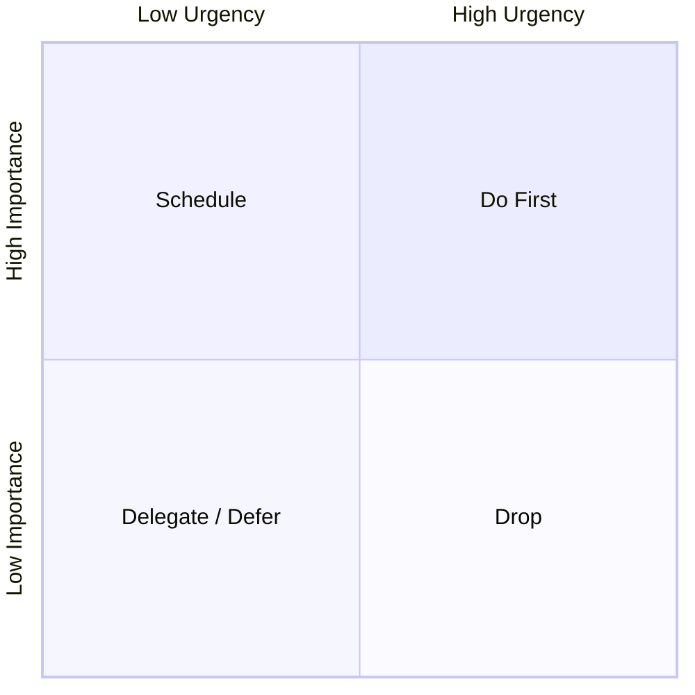

## Inbox
<!-- 思いついたことをここに自由に書く。形式は問わない。後でAIに処理させる。 -->

## MIT (Most Important Tasks, max 3)

## Active
| id | title | status | priority | due | depends_on | tags | estimate |
|----|-------|--------|----------|-----|------------|------|----------|

## Someday / Maybe

## Gantt Chart
```mermaid
gantt
    dateFormat  YYYY-MM-DD
    section Tasks
```

## Dependency Graph
```mermaid
graph LR
```

## Priority Matrix

