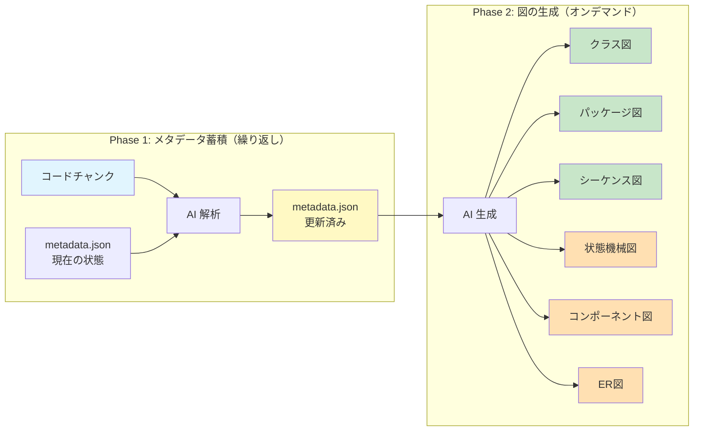
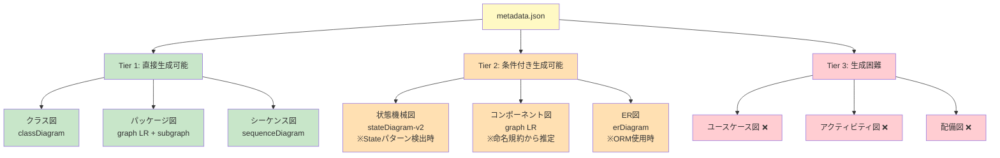
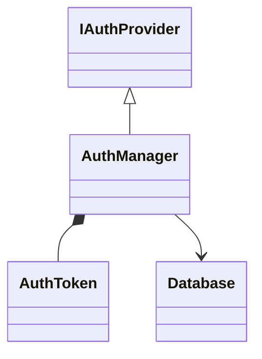
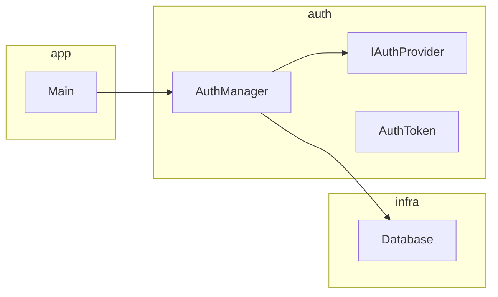
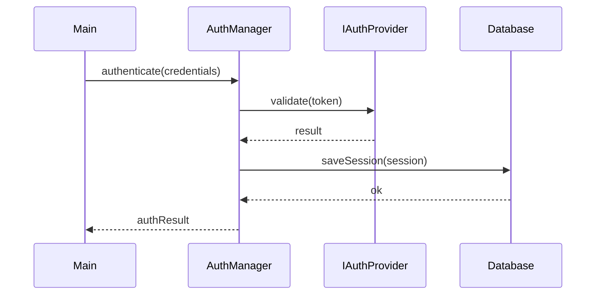

# 要件確認書: 対話型生成AIによるコード依存関係分析ツール

## 1. 背景・目的

コードベースの依存関係を可視化し、開発資料（設計レビュー・オンボーディング・アーキテクチャ分析）として活用するツールを構築する。職場環境においてインターネット接続・API キー利用・外部アカウント登録に制約があるため、対話型生成 AI（UI のみ）とローカルツールで完結する構成を前提とする。

## 2. 制約条件

| 項目 | 内容 |
|------|------|
| 利用可能な AI | 対話形式の生成 AI（UI のみ、API キー利用不可） |
| GitHub | 利用不可 |
| 外部アカウント | 利用不可 |
| 実行環境 | ローカル完結（VS Code + Python） |

## 3. スコープ

### 3.1 対象言語

| 言語 | 依存関係の記述形式 |
|------|---------------------|
| C++ | `#include`（ヘッダ）、継承、前方宣言 |
| Java | `import`、`extends` / `implements`、パッケージ宣言 |
| C# | `using`、`namespace`、継承・インターフェース実装 |

### 3.2 対象外

| 項目 | 理由 |
|------|------|
| 依存関係の自動修正 | スコープ外 |
| API を使った完全自動化 | UI のみ利用のため |
| クラウド同期・共有 | MermaidChart アカウント必須のため |
| PlantUML | Java ローカルインストールが必要 |
| Graphviz / DOT 形式 | VS Code 公式エクステンションが弱いため |
| UML ユースケース図 | アクター・ユースケースはコードに存在しないため生成不可 |
| UML アクティビティ図 | ビジネスプロセス定義がコードに明示されないため生成不可 |
| UML 配備図 | ハードウェア・ノード情報がコードに存在しないため生成不可 |

### 3.3 対象コードベースの規模

本プロジェクトの解析対象は大規模コードベースであることを前提とする。そのためクラス図単独では俯瞰が困難であり、パッケージ図も併せて必須とする（§4.5 参照）。

## 4. 機能要件

### 4.1 全体アーキテクチャ

コードの再読み込みを避けるため、2フェーズ構成を採用する。Phase 1 でコードから構造化メタデータ（JSON）を蓄積し、Phase 2 でメタデータから任意の図をオンデマンド生成する。



### 4.2 依存関係の解析

- 3.1 に挙げた 3 言語のコードファイルを入力として、依存関係を抽出する
- クラス名とファイル名が異なるケースに対応する（MANIFEST セクションで明示的に対応付け）

### 4.3 Phase 1: メタデータ管理（CRUD 操作）

`metadata.json` を状態ストアとし、CRUD 操作でメタデータを管理する。セッションをまたいで継続処理できるよう、`metadata.json` をファイルに保存・再読み込みする。

#### CRUD 操作とプロンプトの対応

| 操作 | プロンプト | 入力 | 処理 |
|------|-----------|------|------|
| **C**reate + **U**pdate | `prompt-phase1-upsert.md` | metadata.json + コードチャンク | 新規ファイルは追加、既存ファイルはコード現状で上書き |
| **R**ead | `prompt-phase2.md` | metadata.json + 図の指示 | メタデータから図を生成（Phase 2） |
| **D**elete | `prompt-phase1-delete.md` | metadata.json + 削除指示 | 指定エントリを除去し、連鎖整理を実行 |

Create と Update は「Upsert（あれば上書き、なければ追加）」として統合する。バンドル内のファイルに対応するメタデータをファイル単位で置換するため、新規追加もソース更新も同一プロンプトで処理できる。バンドルに含まれないファイルのエントリには一切触れない。

#### メタデータ蓄積サイクル（Upsert の繰り返し）

大量のファイルを少量ずつ処理するため、以下のサイクルを繰り返す。

```
[コードチャンク] + [metadata.json] → AI → [metadata.json 更新]
        ↑______________________________________________|
                           繰り返し
```

- AI はコードからクラス・属性・メソッド・呼び出し関係・継承関係・パッケージ所属を抽出し、メタデータに追記・更新する

#### 入力形式

##### コードチャンク（複数ファイル）

```
=== MANIFEST ===
File: src/auth/AuthManager.cpp
Classes: AuthManager, AuthToken
File: src/auth/IAuthProvider.h
Classes: IAuthProvider

=== FILE: src/auth/AuthManager.cpp ===
（ファイル内容）

=== FILE: src/auth/IAuthProvider.h ===
（ファイル内容）
```

- `MANIFEST` セクションでファイルパスとクラス名の対応を宣言する
- このフォーマットへの変換は Python 補助スクリプト（§6）で自動化する

##### 入力サイズの上限

- 1 回の入力あたりのファイル数・文字数は運用しながら調整する
- 上限に達した場合はチャンクを分割して処理する

##### metadata.json のサイズ上限

AI のコンテキストウィンドウからの逆算で決まる。Phase 1 が制約のボトルネックとなる。

```
Phase 1: JSON上限 = AIコンテキスト上限 − プロンプト定型文 − コードチャンクサイズ
Phase 2: JSON上限 = AIコンテキスト上限 − プロンプト定型文 − 図生成指示（短い）
```

JSON が上限を超えた場合は、パッケージ単位でメタデータを分割する:
- `metadata-auth.json`、`metadata-infra.json` 等
- Phase 2 では必要なパッケージの JSON のみを送信すればよい
- 具体的な閾値は使用する AI のコンテキストサイズに応じて運用で調整する

#### 出力形式

AI は更新された `metadata.json` の全文をコードブロックで出力する。利用者はコピーして上書き保存する。

#### メタデータスキーマ

```json
{
  "classes": [
    {
      "name": "AuthManager",
      "file": "src/auth/AuthManager.cpp",
      "package": "auth",
      "visibility": "public",
      "attributes": [
        { "name": "token", "type": "AuthToken", "visibility": "private" }
      ],
      "methods": [
        {
          "name": "authenticate",
          "returnType": "AuthResult",
          "params": [{ "name": "credentials", "type": "Credentials" }],
          "visibility": "public",
          "calls": [
            { "target": "IAuthProvider", "method": "validate" },
            { "target": "Database", "method": "saveSession" }
          ]
        }
      ],
      "relationships": [
        { "type": "implements", "target": "IAuthProvider" },
        { "type": "composition", "target": "AuthToken" },
        { "type": "dependency", "target": "Database" }
      ]
    }
  ],
  "packages": [
    {
      "name": "auth",
      "path": "src/auth/",
      "classes": ["AuthManager", "IAuthProvider", "AuthToken"]
    }
  ],
  "components": [],
  "entities": [],
  "states": []
}
```

`components`・`entities`・`states` は Tier 2 図の生成用に予約されたセクション。Phase 1 では空のまま蓄積し、必要になった時点でユーザーがデータを追加投入する（§4.6 参照）。

### 4.4 Phase 2: 図の生成（オンデマンド）

`metadata.json` を AI に送信し、必要な図の種類を指示して Mermaid 形式で生成させる。

**出力ファイル分離要件**: 図は、人間が `.md` ファイルごとに**コピー&ペーストで保存できる形式**で AI に出力させる。AI は UI 上でファイル書き出しができないため、以下を守る:

- ファイルごとに独立した**コードブロック（\`\`\`markdown … \`\`\`）で丸ごと囲んで出力**する（内側の Mermaid 記法はネストコードブロックとして ``` で表現）
- コードブロックの直前にファイル名を見出しで明示する（例: `### file: class-diagram.md`）
- 複数ファイルを 1 回の応答にまとめてよいが、ファイル間は明確に区切る
- コピー用ブロック内には該当ファイルの**全文**（フロントマター含む）を入れ、差分形式で返さない

これにより利用者はコードブロックのコピーアイコン 1 クリックで各ファイルに上書き保存できる。

### 4.5 生成可能な図の種類と粒度

記法は `03_resources/knowledge/dev-docs-and-diagrams/` の選定ガイドに従う（選定根拠は §9）。

各図では以下を事前に明示する（`02_how-to/select-uml-diagram.md` Step 4）:
- システム境界
- 抽象レベル（関数呼び出し / モジュール / パッケージ など）
- 主な読者
- 更新頻度

#### 生成可能な図の Tier 分類



#### 図ごとの必要メタデータ要素と充足状況

| 図 | Tier | クラス名 | ファイル/パッケージ | 属性 | メソッド | 呼び出し関係 | 継承/実装 | 状態定義 | アクター/ユースケース | デプロイ先 | 充足状況 |
|---|:---:|:---:|:---:|:---:|:---:|:---:|:---:|:---:|:---:|:---:|---|
| クラス図 | 1 | o | - | o | o | - | o | - | - | - | **全て抽出可能** |
| パッケージ図 | 1 | o | o | - | - | - | o | - | - | - | **全て抽出可能** |
| シーケンス図 | 1 | o | - | - | o | o | - | - | - | - | **全て抽出可能** |
| 状態機械図 | 2 | o | - | - | - | - | - | o | - | - | **状態定義**: Stateパターン使用時のみ抽出可能 |
| コンポーネント図 | 2 | o | o | - | - | - | o | - | - | - | **コンポーネント境界**: 命名規約・フォルダ構造から推定 |
| ER図 | 2 | o | - | o | - | - | o | - | - | - | **テーブル/カラム**: ORM定義から抽出可能。Raw SQLは困難 |
| ユースケース図 | 3 | - | - | - | - | - | - | - | **不足** | - | アクター・ユースケースはコードに存在しない |
| アクティビティ図 | 3 | - | - | - | - | - | - | - | - | - | ビジネスプロセス定義がコードに明示されない |
| 配備図 | 3 | - | - | - | - | - | - | - | - | **不足** | ハードウェア・ノード情報がコードに存在しない |

---

#### ① UML クラス図（Tier 1・必須）

- **標準**: UML 2.5 構造図、クラス図
- **Mermaid 記法**: `classDiagram`
- **表現対象**: クラス・属性・メソッド・継承 / 集約 / 依存の関係
- **使用するメタデータ**: `classes`（name, attributes, methods, relationships）
- **粒度**: 詳細設計〜実装レベル（資料用抽象度と実装レベルを混在させない）
- **読者**: 開発者、設計レビュー担当
- **用途**: 既存実装の静的構造把握、オンボーディング資料
- **出力ファイル**: `class-diagram.md`



---

#### ② UML パッケージ図（Tier 1・必須）

- **標準**: UML 2.5 構造図、パッケージ図
- **Mermaid 記法**: `graph LR` + `subgraph`（Mermaid はパッケージ図の専用記法を持たないため代替）
- **表現対象**: ファイル / パッケージ単位の論理モジュール分割と依存関係
- **使用するメタデータ**: `packages`（name, path, classes）+ `classes.relationships`
- **粒度**: 基本設計レベル
- **読者**: アーキテクト、開発者
- **用途**: 大規模コードベース全体の俯瞰、**依存循環検知**
- **出力ファイル**: `package-diagram.md`



---

#### ③ UML シーケンス図（Tier 1・必須）

- **標準**: UML 2.5 振る舞い図、シーケンス図
- **Mermaid 記法**: `sequenceDiagram`
- **表現対象**: クラス間の関数呼び出しの時間軸での相互作用（メソッド呼び出しチェーン）
- **使用するメタデータ**: `classes`（name, methods, methods.calls）
- **粒度**: 詳細設計〜実装レベル（関数呼び出しレベルに統一し、HTTP API レベルと混在させない）
- **読者**: 開発者、設計レビュー担当
- **用途**: クラス図①で把握した静的構造の補完として、クラス間の呼び出し関係を時間軸で表現する。処理フローの理解・オンボーディング資料
- **蓄積方針**: 全呼び出し関係をメタデータに蓄積する。可読性のための分割・フィルタリングは AI に都度依頼して抽出させる
- **出力ファイル**: `sequence-diagram.md`



---

#### ④ UML 状態機械図（Tier 2・条件付き）

- **標準**: UML 2.5 振る舞い図、状態機械図
- **Mermaid 記法**: `stateDiagram-v2`
- **表現対象**: オブジェクトの状態遷移
- **使用するメタデータ**: `states`（予約セクション）
- **生成条件**: State パターンの使用が検出された場合、または enum + switch/case パターンから状態候補を AI が検出した場合
- **Tier 1 への昇格**: ユーザーが `states` セクションに状態名・遷移条件を定義すれば生成可能
- **出力ファイル**: `state-diagram.md`

---

#### ⑤ UML コンポーネント図（Tier 2・条件付き）

- **標準**: UML 2.5 構造図、コンポーネント図
- **Mermaid 記法**: `graph LR`
- **表現対象**: コンポーネント（論理的なまとまり）と提供/要求インターフェース
- **使用するメタデータ**: `components`（予約セクション）+ `packages` + `classes.relationships`
- **生成条件**: 命名規約・フォルダ構造からコンポーネント境界を推定できる場合
- **Tier 1 への昇格**: ユーザーが `components` セクションにパッケージ→コンポーネントの対応表を定義すれば生成可能（1回定義すれば以降は自動）
- **出力ファイル**: `component-diagram.md`

---

#### ⑥ ER図（Tier 2・条件付き）

- **標準**: ER 図（非 UML）
- **Mermaid 記法**: `erDiagram`
- **表現対象**: テーブル・カラム・リレーション
- **使用するメタデータ**: `entities`（予約セクション）
- **生成条件**: ORM フレームワーク（JPA / Entity Framework 等）の定義がコード内に存在する場合
- **Tier 1 への昇格**: DDL / マイグレーションファイルを `bundle.py` の入力に追加するか、ユーザーが `entities` セクションにテーブル定義を追加すれば生成可能
- **出力ファイル**: `er-diagram.md`

---

### 4.6 循環依存レポート

- 循環依存を検出した場合、パッケージ図（②）のノードに視覚的警告を付与する
- レポートとして循環しているクラス／ファイルの一覧をテキストで出力する（`cyclic-dependencies.md` として別ファイル出力）
- 修正の実施は対象外

出力イメージ:
```
[循環依存レポート]
- AuthManager → TokenService → AuthManager  ⚠️
- Parser → Lexer → Parser  ⚠️
```

## 5. 非機能要件

### 5.1 可視化

- VS Code 上でローカルプレビューが可能であること
- 使用エクステンション: **Mermaid Chart**（公式、`MermaidChart.vscode-mermaid-chart`）
  - アカウント登録不要・ローカル完結
  - `.md` ファイル内の Mermaid コードブロックをリアルタイムプレビュー

### 5.2 出力形式

- ファイル形式: Markdown（`.md`）および JSON（`.json`）
- Mermaid コードブロック（````mermaid`）として記述
- Obsidian への貼り付け・転用が可能な形式
- **出力ファイル一覧**（全て Phase 2 でオンデマンド生成。スケルトンの事前配置は不要）:
  - `metadata.json` — コード解析メタデータ（Phase 1 出力、Phase 2 入力）
  - `class-diagram.md` — UML クラス図（Tier 1）
  - `package-diagram.md` — UML パッケージ図（Tier 1）
  - `sequence-diagram.md` — UML シーケンス図（Tier 1）
  - `state-diagram.md` — UML 状態機械図（Tier 2・条件付き）
  - `component-diagram.md` — UML コンポーネント図（Tier 2・条件付き）
  - `er-diagram.md` — ER図（Tier 2・条件付き）
  - `cyclic-dependencies.md` — 循環依存レポート（検出時のみ）

### 5.3 環境

- 外部ネットワーク接続不要で動作すること
- 職場 PC への追加インストールは VS Code エクステンションのみ

## 6. 補助ファイル

### 6.1 Python スクリプト

| スクリプト | 処理内容 |
|-----------|----------|
| `bundle.py` | 指定ディレクトリのファイルを MANIFEST 形式に変換して出力 |

実行環境: Python（バージョン未確定、§8 で確認）

### 6.2 AI 定型プロンプト

metadata.json の管理を CRUD 操作に対応する 3 つのプロンプトで構成する（§4.3 参照）。

| ファイル | CRUD | 用途 | 入力 | 出力 |
|---------|------|------|------|------|
| `prompt-phase1-upsert.md` | C + U | メタデータの蓄積・更新 | metadata.json + コードチャンク | 更新された metadata.json |
| `prompt-phase1-delete.md` | D | メタデータの削除 | metadata.json + 削除指示 | 更新された metadata.json |
| `prompt-phase2.md` | R | 図の生成 | metadata.json + 自然言語指示 | Mermaid .md ファイル |

- 各プロンプトは「あなたの役割」以降を AI に貼り付けて使用する自己完結型
- `prompt-phase1-upsert.md` は新規ファイルの追加もソース更新の反映も同一プロンプトで処理（Upsert セマンティクス）
- `prompt-phase2.md` には全 6 種の図のフォーマットテンプレート（フロントマター含む）を埋め込み、1 プロンプト + metadata.json のコピペだけで任意の図を生成可能
- `prompt-legacy.md` は旧単一フェーズ構成のプロンプト（後方互換用に保持）

## 7. 運用フロー

```
【Phase 1 Upsert: メタデータ蓄積・更新（繰り返し）】
1. bundle.py で対象ファイルを MANIFEST 形式に変換
2. prompt-phase1-upsert.md の本文 + metadata.json + バンドルを AI に貼り付けて送信
3. AI が更新された metadata.json を返すのでコピーして上書き保存
4. 次のチャンクで 1 に戻る
※ ソースが更新された場合も同じ手順。変更されたファイルを bundle.py で再変換して投入する

【Phase 1 Delete: メタデータ削除（必要に応じて）】
5. prompt-phase1-delete.md の本文 + metadata.json を AI に貼り付けて送信
6. 削除対象のファイルパス・クラス名・パッケージ名を自然言語で指示
7. AI が更新された metadata.json を返すのでコピーして上書き保存

【Phase 2 Read: 図の生成（オンデマンド）】
8. prompt-phase2.md の本文 + metadata.json を AI に貼り付けて送信
9. 生成したい図の種類・範囲・条件を自然言語で指示
   例: 「Tier 1 全て」「auth パッケージのクラス図」「authenticate の呼び出しチェーンのシーケンス図」
10. AI がファイル単位のコピー用コードブロック（§4.4 出力ファイル分離要件）を返すので、
    各コードブロックをコピーして対応する .md ファイルに保存
11. VS Code でプレビュー確認

【Tier 2 図の追加生成（必要に応じて）】
12. metadata.json の予約セクション（components / entities / states）に
    追加データを AI に投入して埋めてもらう（Upsert プロンプトで指示）
13. Phase 2 と同様に図を生成
```

## 8. 未確定事項

- [ ] Python のバージョン・実行可否の最終確認
- [ ] `bundle.py` でのチャンク分割サイズ（運用しながら調整）
- [x] Phase 1 用 AI プロンプトの定型文設計 → CRUD 分割で実装済み（`prompt-phase1-upsert.md` + `prompt-phase1-delete.md`）
- [x] Phase 2 用 AI プロンプトの定型文設計 → `prompt-phase2.md` として実装済み（全 6 種の図テンプレート埋め込み）
- [x] `metadata.json` のスキーマ最終確定 → §4.3 のスキーマで確定、`prompt-phase1-upsert.md` に再掲
- [ ] JSON のサイズ上限の具体的な閾値（使用する AI のコンテキストサイズに応じて運用で確定）

## 9. 付録: 記法選定の根拠（dev-docs-and-diagrams 参照）

本文書の記法選定は `03_resources/knowledge/dev-docs-and-diagrams/` に基づく。

- **文書形式**: 規制対応なし・個人ツール・反復的運用のため SRS-lite（IEEE 830 構成を簡略化）を採用。`02_how-to/select-text-doc-format.md` の要件記述フロー参照。
- **メタデータ中心アーキテクチャの採用理由**:
  - 大規模コードベースでは図の種類を変えるたびにコードを再読み込みさせることは非効率
  - 構造化メタデータ（JSON）を中間層として蓄積することで、1回のコード読み込みから複数種類の図をオンデマンド生成できる
  - メタデータスキーマに予約セクション（`components`・`entities`・`states`）を設けることで、追加データの投入により段階的に生成可能な図を拡張できる
- **出力図（Tier 分類）**:
  - **Tier 1（直接生成可能）**: クラス図・パッケージ図・シーケンス図。静的コード解析で必要な全メタデータ要素を抽出可能。`03_reference/uml-catalog.md` 実務頻度 6 種のうち 3 種に該当
  - **Tier 2（条件付き生成可能）**: 状態機械図・コンポーネント図・ER図。メタデータの予約セクションにユーザーが追加データを投入することで生成可能になる
  - **Tier 3（生成困難）**: ユースケース図・アクティビティ図・配備図。必要な情報（アクター・ビジネスプロセス・デプロイ先）がコードに存在しないため対象外
  - 旧「コールグラフ（静的 `graph LR`）」は UML 標準外かつ粒度混在アンチパターン（`02_how-to/select-uml-diagram.md` よくあるアンチパターン）であり不採用。関数呼び出しの可視化は UML 標準のシーケンス図（`sequenceDiagram`）で対応する
- **粒度管理**: 各図で システム境界・抽象レベル・読者・更新頻度を事前明示する方針は `02_how-to/select-uml-diagram.md` Step 4 に従う
