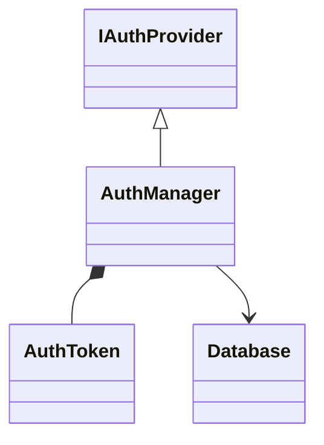
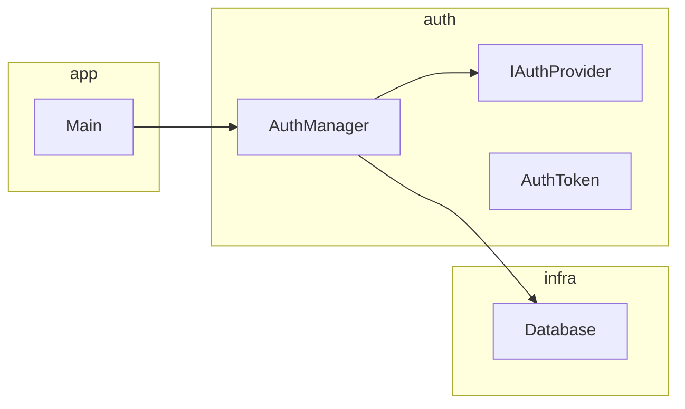

# 要件確認書: 対話型生成AIによるコード依存関係分析ツール

## 1. 背景・目的

コードベースの依存関係を可視化し、開発資料（設計レビュー・オンボーディング・アーキテクチャ分析）として活用するツールを構築する。職場環境においてインターネット接続・API キー利用・外部アカウント登録に制約があるため、対話型生成 AI（UI のみ）とローカルツールで完結する構成を前提とする。

## 2. 制約条件

| 項目 | 内容 |
|------|------|
| 利用可能な AI | 対話形式の生成 AI（UI のみ、API キー利用不可） |
| GitHub | 利用不可 |
| 外部アカウント | 利用不可 |
| 実行環境 | ローカル完結（VS Code + Python） |

## 3. スコープ

### 3.1 対象言語

| 言語 | 依存関係の記述形式 |
|------|---------------------|
| C++ | `#include`（ヘッダ）、継承、前方宣言 |
| Java | `import`、`extends` / `implements`、パッケージ宣言 |
| C# | `using`、`namespace`、継承・インターフェース実装 |

### 3.2 対象外

| 項目 | 理由 |
|------|------|
| 依存関係の自動修正 | スコープ外 |
| API を使った完全自動化 | UI のみ利用のため |
| クラウド同期・共有 | MermaidChart アカウント必須のため |
| PlantUML | Java ローカルインストールが必要 |
| Graphviz / DOT 形式 | VS Code 公式エクステンションが弱いため |
| C4 Component 図（レイヤー図） | 層間依存違反検出は改良フェーズのニーズ。現状把握スコープ外 |
| UML シーケンス図（コールグラフ） | 動的挙動追跡は改良フェーズのニーズ。現状把握スコープ外 |
| UML 状態機械図 | 状態遷移把握は改良フェーズのニーズ。現状把握スコープ外 |

### 3.3 対象コードベースの規模

本プロジェクトの解析対象は大規模コードベースであることを前提とする。そのためクラス図単独では俯瞰が困難であり、パッケージ図も併せて必須とする（§4.4 参照）。

## 4. 機能要件

### 4.1 依存関係の解析

- 3.1 に挙げた 3 言語のコードファイルを入力として、依存関係を抽出する
- クラス名とファイル名が異なるケースに対応する（MANIFEST セクションで明示的に対応付け）

### 4.2 状態の保持（イテレーティブ処理）

大量のファイルを少量ずつ処理するため、以下のサイクルを繰り返す。

```
[コードチャンク] + [現在のMermaid状態] → AI → [更新されたMermaid状態]
        ↑___________________________________________________|
                           繰り返し
```

- Mermaid 形式のテキストを状態ストアとして使用する
- セッションをまたいで継続処理できるよう、Mermaid テキストをファイルに保存・再読み込みする

### 4.3 入力形式

#### コードチャンク（複数ファイル）

```
=== MANIFEST ===
File: src/auth/AuthManager.cpp
Classes: AuthManager, AuthToken
File: src/auth/IAuthProvider.h
Classes: IAuthProvider

=== FILE: src/auth/AuthManager.cpp ===
（ファイル内容）

=== FILE: src/auth/IAuthProvider.h ===
（ファイル内容）
```

- `MANIFEST` セクションでファイルパスとクラス名の対応を宣言する
- このフォーマットへの変換は Python 補助スクリプト（§6）で自動化する

#### 入力サイズの上限

- 1 回の入力あたりのファイル数・文字数は運用しながら調整する
- 上限に達した場合はチャンクを分割して処理する

### 4.4 出力する図の種類と粒度

既存実装の現状把握（リバースエンジニアリング）を目的に、以下の図を生成する。記法は UML 2.5 標準および一般的な選定ガイドラインに従う（選定根拠は §9）。

**出力ファイル分離要件**: クラス図とパッケージ図は、人間が `.md` ファイルごとに**コピー&ペーストで保存できる形式**で AI に出力させる。AI は UI 上でファイル書き出しができないため、以下を守る:

- ファイルごとに独立した**コードブロック（\`\`\`markdown … \`\`\`）で丸ごと囲んで出力**する（内側の Mermaid 記法はネストコードブロックとして ``` で表現）
- コードブロックの直前にファイル名を見出しで明示する（例: `### file: class-diagram.md`）
- 複数ファイルを 1 回の応答にまとめてよいが、ファイル間は明確に区切る
- コピー用ブロック内には該当ファイルの**全文**（フロントマター含む）を入れ、差分形式で返さない

これにより利用者はコードブロックのコピーアイコン 1 クリックで各ファイルに上書き保存できる。

各図では以下を事前に明示する:
- システム境界
- 抽象レベル（関数呼び出し / モジュール / パッケージ など）
- 主な読者
- 更新頻度

---

#### ① UML クラス図（コア・必須）

- **標準**: UML 2.5 構造図、クラス図
- **Mermaid 記法**: `classDiagram`
- **表現対象**: クラス・属性・メソッド・継承 / 集約 / 依存の関係
- **粒度**: 詳細設計〜実装レベル（資料用抽象度と実装レベルを混在させない）
- **読者**: 開発者、設計レビュー担当
- **用途**: 既存実装の静的構造把握、オンボーディング資料
- **出力ファイル**: `class-diagram.md`（単独）



---

#### ② UML パッケージ図（コア・必須）

- **標準**: UML 2.5 構造図、パッケージ図
- **Mermaid 記法**: `graph LR` + `subgraph`（Mermaid はパッケージ図の専用記法を持たないため代替）
- **表現対象**: ファイル / パッケージ単位の論理モジュール分割と依存関係
- **粒度**: 基本設計レベル
- **読者**: アーキテクト、開発者
- **用途**: 大規模コードベース全体の俯瞰、**依存循環検知**
- **派生関係**: クラス図①と MANIFEST（クラス→ファイルパス対応）から集約生成する派生ビュー。AI には同一チャンク処理内でクラス図と同時生成させ、乖離を防ぐ
- **出力ファイル**: `package-diagram.md`（単独）



---

### 4.5 循環依存レポート

- 循環依存を検出した場合、パッケージ図（②）のノードに視覚的警告を付与する
- レポートとして循環しているクラス／ファイルの一覧をテキストで出力する（`cyclic-dependencies.md` として別ファイル出力）
- 修正の実施は対象外

出力イメージ:
```
[循環依存レポート]
- AuthManager → TokenService → AuthManager  ⚠️
- Parser → Lexer → Parser  ⚠️
```

## 5. 非機能要件

### 5.1 可視化

- VS Code 上でローカルプレビューが可能であること
- 使用エクステンション: **Mermaid Chart**（公式、`MermaidChart.vscode-mermaid-chart`）
  - アカウント登録不要・ローカル完結
  - `.md` ファイル内の Mermaid コードブロックをリアルタイムプレビュー

### 5.2 出力形式

- ファイル形式: Markdown（`.md`）
- Mermaid コードブロック（````mermaid`）として記述
- Obsidian への貼り付け・転用が可能な形式
- **図ごとに 1 ファイル**:
  - `class-diagram.md` — UML クラス図
  - `package-diagram.md` — UML パッケージ図
  - `cyclic-dependencies.md` — 循環依存レポート（検出時のみ）

### 5.3 環境

- 外部ネットワーク接続不要で動作すること
- 職場 PC への追加インストールは VS Code エクステンションのみ

## 6. 補助スクリプト（Python）

| スクリプト | 処理内容 |
|-----------|----------|
| `bundle.py` | 指定ディレクトリのファイルを MANIFEST 形式に変換して出力 |

実行環境: Python 3.8 以上（標準ライブラリのみ使用）

## 7. 運用フロー

```
【繰り返し処理】
1. bundle.py で対象ファイルを MANIFEST 形式に変換
2. 現在の class-diagram.md ＋ package-diagram.md ＋ チャンクを AI に貼り付けて送信
3. AI がファイル単位のコピー用コードブロック（§4.4 出力ファイル分離要件）を返すので、
   各コードブロックをコピーして対応する .md ファイルに上書き保存
4. VS Code でプレビュー確認（各 .md を個別に開く）
5. 次のチャンクで 1 に戻る
         ↓
【完了後】
6. class-diagram.md / package-diagram.md / cyclic-dependencies.md（検出時）を開発資料としてそのまま利用
```

## 8. 未確定事項

- [ ] `bundle.py` でのチャンク分割サイズ（運用しながら調整）
- [ ] クラス図 + パッケージ図を同時出力させる AI プロンプトの定型文設計

## 9. 記法選定の根拠

- **文書形式**: 規制対応が不要な個人・小規模開発での反復的運用を想定し、**SRS-lite**（IEEE 830 のソフトウェア要件仕様書構成を簡略化した軽量形式）を採用した。重厚な承認プロセスを伴わないが、背景・制約・スコープ・機能／非機能要件を最低限押さえる。
- **出力図の絞り込み**: 本ツールの目的は「既存実装の現状把握（リバースエンジニアリング）」であるため、静的構造を表す **UML クラス図**を中心に据えた。加えて、対象が大規模コードベース（§3.3）であるため、論理モジュール分割と依存循環検知のために **UML パッケージ図**を必須とし、クラス図と同一チャンク処理で同時生成することで派生ビューの整合性を担保する。
- **除外した図**: C4 Component 図（層間依存違反検出）、UML シーケンス図（動的挙動追跡）、UML 状態機械図（状態遷移把握）は改良フェーズ以降のニーズでありスコープ外とした。Mermaid の非 UML `graph LR` を用いたコールグラフは粒度混在のアンチパターンとなりやすく、動的挙動追跡がスコープ外であることとも併せ不採用とした。
- **粒度管理**: 各図で「システム境界・抽象レベル・読者・更新頻度」を事前明示する方針を採る（§4.4）。
